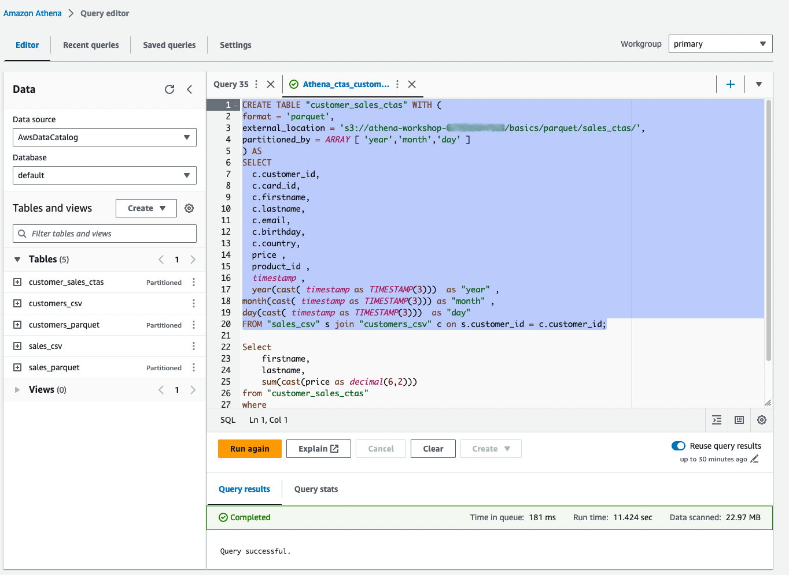
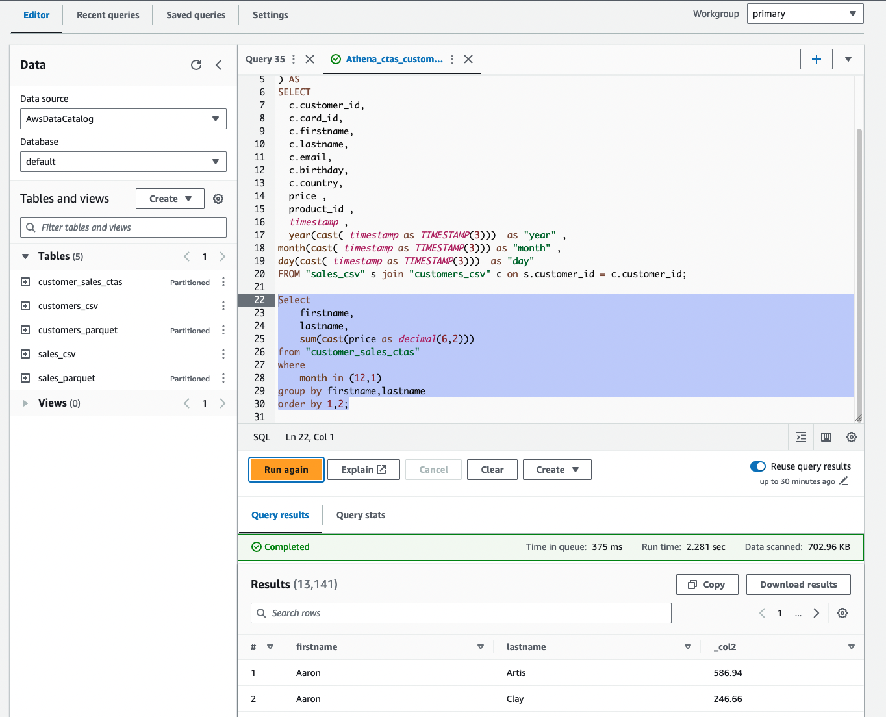

---

Thông thường, dữ liệu thô được đưa vào data lake ở định dạng csv hoặc văn bản. Các định dạng này không tối ưu để truy vấn với Athena và các công cụ khác. Nên chuyển đổi dữ liệu thành các định dạng cột như parquet. Trong bài lab này, chúng ta sẽ sử dụng truy vấn Create Table As Select ( CTAS ) để tạo bảng mới từ bảng định dạng csv hiện có. Truy vấn Create Table as Select (CTAS) sẽ tạo một bảng định dạng parquet mới có tính năng nén và phân vùng, sau đó điền dữ liệu vào bảng đó.

1. Từ  Athena query editor, chọn **Saved Queries** và nhấn vào ID truy vấn cho truy vấn có tên **Athena_ctas_customer_sale**

2. Có 2 câu lệnh truy vấn trong truy vấn ở saved query. Truy vấn đầu tiên sẽ tạo một bảng mới có tên là **customer_sale_ctas**. Nếu bạn nhìn vào câu lệnh truy vấn, có một số điều cần lưu ý:
- Định dạng được đặt thành parquet là định dạng bảng cột
- Chúng ta đang lưu trữ các tập tin ở vị trí bên ngoài. Trong trường hợp này, s3 bucket được tạo cho workshop ở /basics/parquet/sale_ctas/ prefix.
- Dữ liệu sẽ được phân chia theo năm, tháng, ngày
- Chúng ta đang sử dụng truy vấn SELECT để chọn dữ liệu từ các bảng hiện có để điền vào bảng mới.

3. Đánh dấu truy vấn đầu tiên và chọn **Run** để tạo bảng mới. Sẽ mất vài phút để truy vấn này chạy. Khi nó hiển thị **Completed** trong tab kết quả truy vấn, hãy chuyển sang bước tiếp theo.

4. Đánh dấu truy vấn thứ hai và nhấp vào nút **Run** Điều này sẽ truy vấn bảng mới tạo của bạn.

Qua đó, chúng ta đã tạo thành công một bảng mới trong data lake của mình và thêm dữ liệu vào đó bằng truy vấn Athena Create Table As Select (CTAS).
