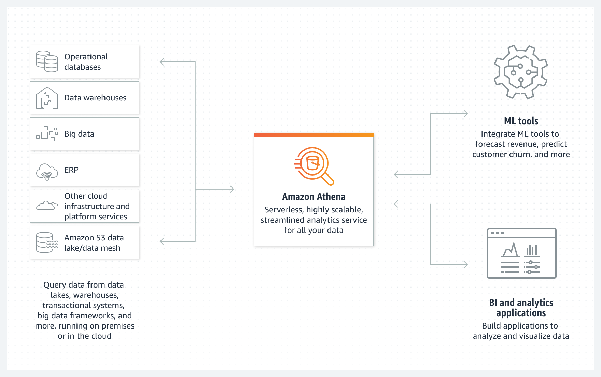

# Làm việc với Amazon Athena

Trong bài lab này, bạn sẽ tìm hiểu các khái niệm cơ bản và thực hành về Amazon Athena.

Amazon Athena là dịch vụ interactive analytics, serverless, được xây dựng trên các open-source frameworks, hỗ trợ các định dạng file và open-table. Athena cung cấp một cách đơn giản, linh hoạt để phân tích hàng petabyte dữ liệu nơi nó tồn tại. Phân tích dữ liệu hoặc xây dựng ứng dụng từ data lake Amazon Simple Storage Service (S3) và 30 nguồn dữ liệu, bao gồm nguồn dữ liệu on-premises hoặc các hệ thống đám mây khác sử dụng SQL hoặc Python. Athena được xây dựng trên các công cụ Trino và Presto mã nguồn mở cũng như các Apache Spark frameworks mà không cần nỗ lực cung cấp hoặc cấu hình.

### Nội dung

 1. [Amazon Athena là gì?](1-athena/)
 2. [Các bước chuẩn bị](2-prepare/)
 3. [Athena Basics](3-basics/)
 4. [ETL và Athena CTAS](4-etl/)
 5. [Athena Workgroups](5-athena-wg/)
 6. [Trực quan hóa bằng Quicksight trên Amazon Athena](6-qs/)
 6. [Dọn dẹp tài nguyên](7-cleanup/)
